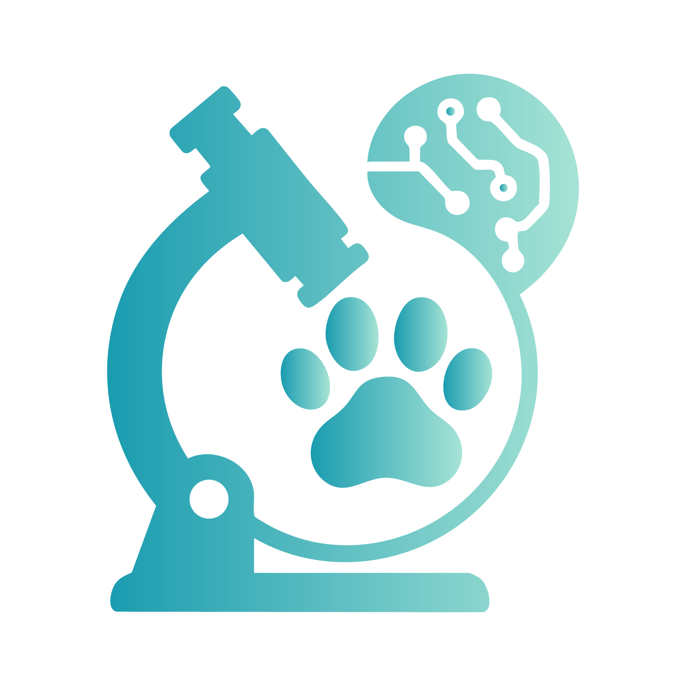
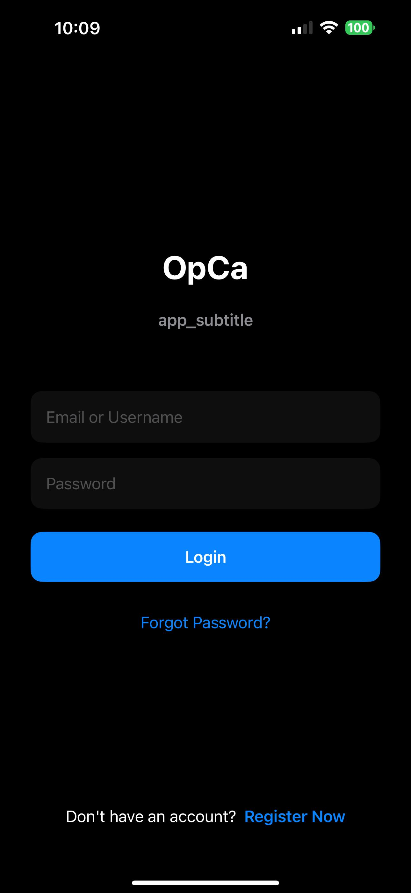
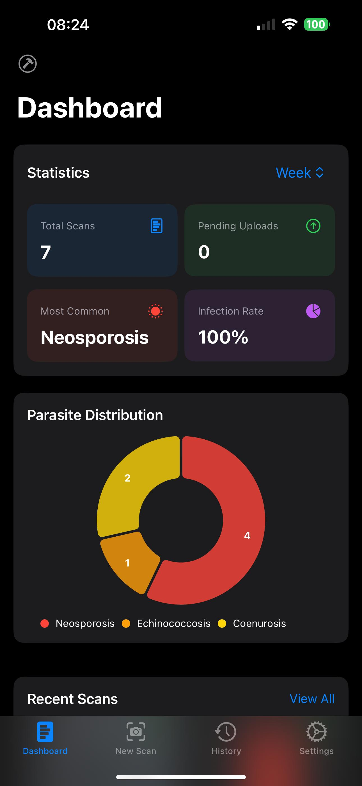
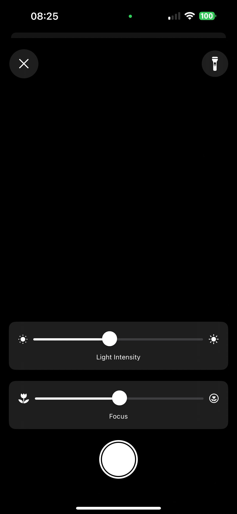
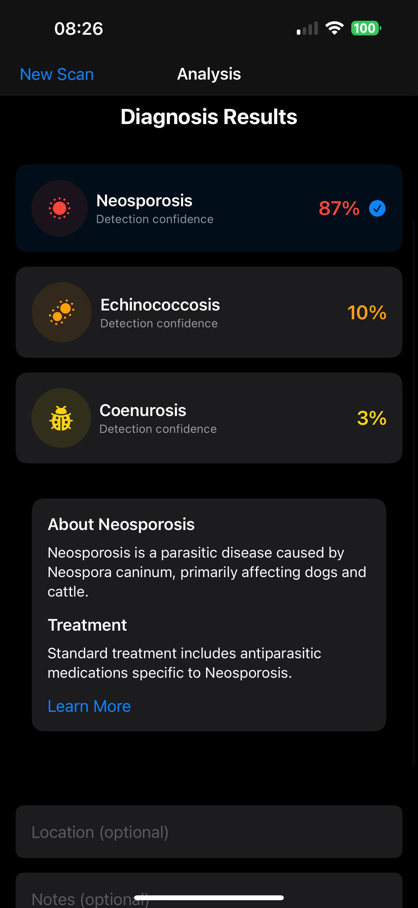
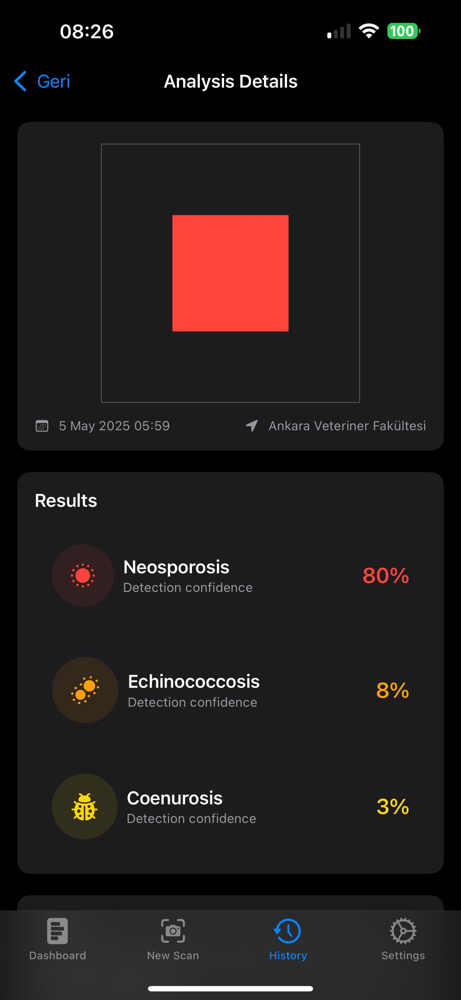
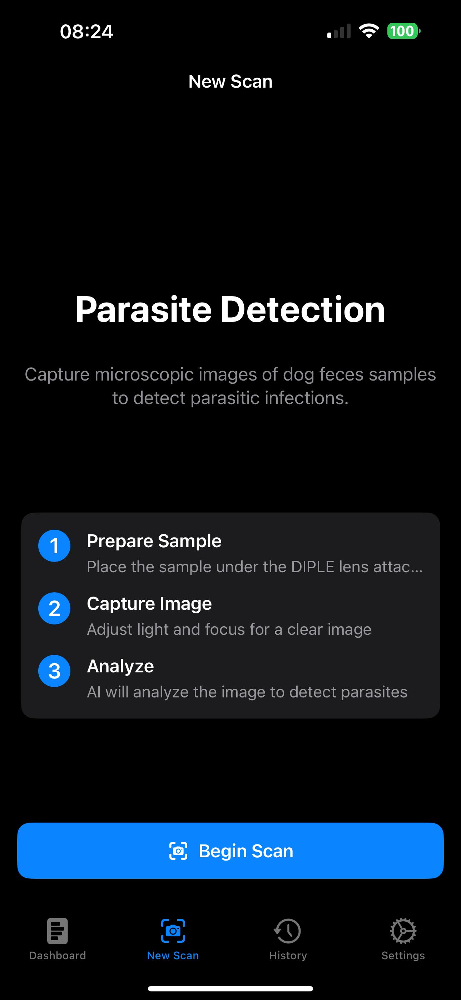
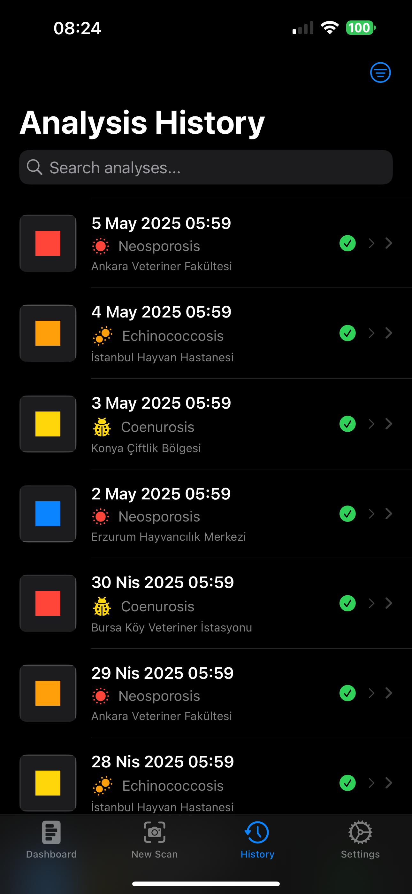
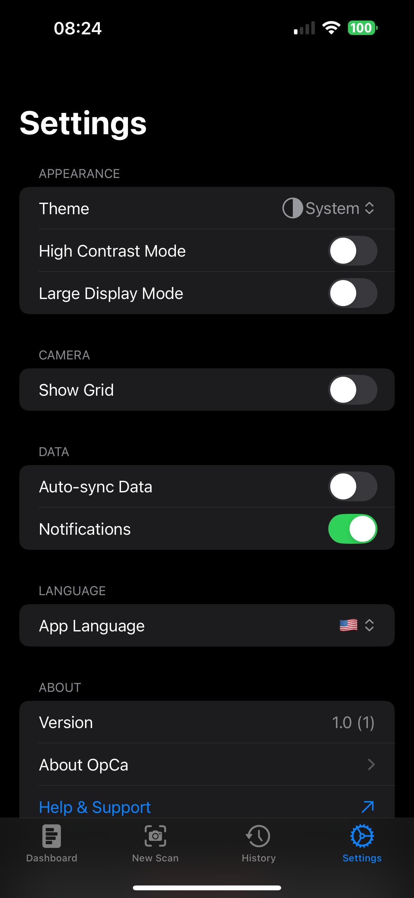

# OpCa - Veterinary Diagnostic Tool

OpCa is a modern mobile application designed for veterinarians to diagnose parasitic infections in dogs using microscopic image analysis. By capturing images through DIPLE lenses attached to smartphones, the app utilizes AI technology to identify parasites such as Neosporosis, Echinococcosis, and Coenurosis in dog feces.



## Features

- **Microscopic Image Capture**: Optimized camera interface for use with DIPLE light stands with light intensity and focus control
- **AI-Powered Analysis**: Advanced image processing to detect parasitic infections
- **Diagnosis Results**: Clear visual indicators with confidence percentages for each parasite type
- **Secure Authentication**: User registration and login with secure token management
- **Multilingual Support**: Available in Turkish and English, with easy extension to other languages
- **Veterinarian Dashboard**: User-friendly layout with recent results, statistics, and upload status
- **Offline Functionality**: Works in field conditions with data synchronization when online
- **Accessibility Features**: High contrast mode and large display settings

## Screenshots

### Login & Authentication
Secure user authentication with registration and password reset functionality.



### Dashboard
Overview of statistics and recent scans with intuitive visualizations.



### Camera Capture
Specialized camera interface optimized for microscopic imaging with DIPLE lenses.



### Image Analysis Process
Real-time progress display during AI analysis of captured samples.



### Diagnosis Results
Clear visualization of results with confidence levels for each parasite type.



### New Scan



### Analysis History
Complete history of all analyses with filtering and search capabilities.




### Setting



## Technical Specifications

- **Platform**: iOS 18.4+
- **Framework**: SwiftUI
- **Language**: Swift 6.0
- **Data Management**: SwiftData
- **Architecture**: MVVM (Model-View-ViewModel)
- **State Management**: @Observable, @Model, @State, @StateObject
- **Concurrency**: Async/await pattern
- **Networking**: Native URLSession 
- **IDE**: Xcode 16.3

## Installation

1. Clone the repository:
```
git clone https://github.com/yourusername/OpCa.git
```

2. Open the project in Xcode 16.3 or later
```
cd OpCa
open OpCa.xcodeproj
```

3. Select a target device running iOS 18.4 or later

4. Build and run the application

## Project Structure

```
OpCa/
├── Models/          # Data models and SwiftData entities
├── Views/           # SwiftUI view components
├── ViewModels/      # ViewModel classes for MVVM architecture
├── Services/        # Network, camera, and other service classes
├── Utilities/       # Helper functions and extensions
│   ├── Localization/ # Localization resources
│   └── Extensions/   # Swift extensions
├── Data/            # Sample data generators and persistance helpers
└── Resources/       # Assets, fonts, and other resources
```

## Localization

OpCa supports multiple languages with a robust localization framework:

- English (default)
- Turkish

Adding a new language is straightforward:
1. Create a new `{language_code}.lproj` folder
2. Add a `Localizable.strings` file with translated key-value pairs
3. The app will automatically detect and use available translations

## Future Development

- Additional language support
- Enhanced AI models for more parasitic species
- Cloud synchronization for veterinary practices
- Integration with laboratory information systems (LIS)
- Interactive educational content for each parasite type

## Acknowledgements

- DIPLE for microscope lens technology
- Veterinary research partners for parasite identification expertise
- Open-source Swift community for helpful libraries and guidance

## Contact

For questions or support, please contact:

İbrahim Hulusi Oflaz - [contact@example.com](mailto:contact@example.com)

## License

This project is licensed under the MIT License - see the LICENSE file for details. 